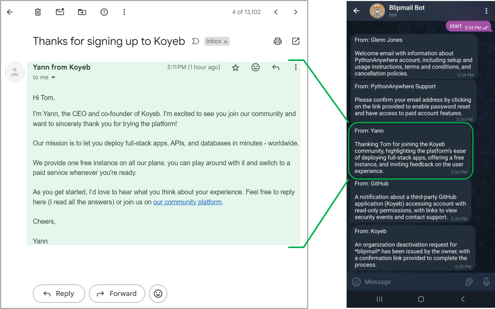
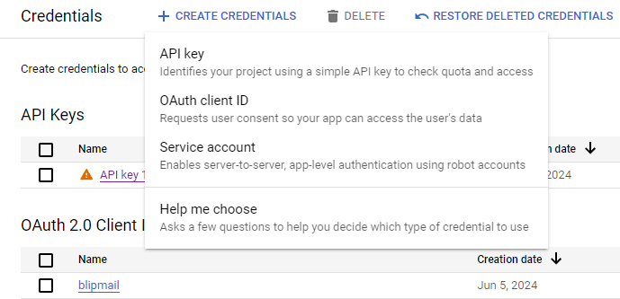

# Blipmail Bot

## What is it?
An AI, [Groq](https://groq.com/)-powered (free equivalent-*ish* version of ChatGPT) Telegram bot that checks my Gmail for any new emails in the last 30 minutes and sends out a 30 word summary of each email





## But why?
Okay this one's easy. 

**Short answer**: Because our inboxes get spammed all day every day.

**Long answer**: We get spammed on the daily with things we may not even really care about. Even after Google's lovely filtering, I still received 20 emails in the past day. Wouldn't it be great if we had someone or *something* read our emails for us? 

Instead of having to click through 20 emails, I now only need to read 20 short messages from ol' mate Blipmail Bot.


## But how?
When the script is running:
- Every 30 minutes retrieves the list of emails that were received in the last 30 minutes
- For each new email the sender's information and email body is then sent over to Groq, which then does it's AI thing with a hardcoded prompt to send back a summary of the email
- This response is routed through to Telegram (using the telebot library) and is sent as a message to you!


## Set up instructions
Things you're going to need:
1. An .env file (have a look at the .env_sample file in the repo)
1. Groq API key (it's free)
1. Telegram bot API key (it's also free)
1. Google Cloud credentials
1. Install dependencies

### Groq API key
- Get your API key from the [Groq console](https://console.groq.com/docs/quickstart), "Create an API key" heading
- Paste that into your **.env** file

### Telegram bot API key
- Open Telegram and search for @BotFather
- Type in "/newbot", give it a name and a Telegram handle
- Copy the bot token that Bot Father gives you and paste that into the **.env** file

### Google Cloud credentials
- Log into your Google Cloud account
- Start up a new project space, call it "Blipmail Bot", or "Butlermail Bot", whatever you want
- In the search bar type in "Gmail API", once it shows up click "Enable API"
- Navigate to the "APIs & Services" console and click on "Credentials" in the left-side menu
- Click on "Create Credentials" then click on "OAuth client ID", click "Desktop app" and give it a name; note, you may be asked to set up the OAuth consent screen before getting to this stage, just click through and add in your own email to the relevant fields



- Once it's created it should give you the credentials with the option to download the "Client secrets"
- Click the download button and you should get a JSON file, rename this to "client_secret.json" and put it in the root directory

### Install dependencies
```
pip install -r requirements.txt
```
- Install the dependencies by running the above command

## Good to go
At this stage you should be ready to rumble, don't forget to start a conversation with the bot with a single message to get the listening loop started:
```
python3 main.py
```
When you first run the script you will get an authenticator message in the console; click that link and you'll be taken to the Google OAuth consent screen giving authorisation to the app to access your Gmail account

### Other notes
- I decided to host my script on [pythonanywhere.com](https://www.pythonanywhere.com/) so the script continues to run in the background in the cloud 🌧️, it's also free